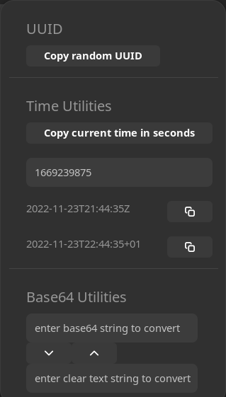

# Dev-Tools

This is my little [Gnome Shell](https://wiki.gnome.org/Projects/GnomeShell) extension. It contains some small helpers that I use on my every day job as a software developer.

These are currently:

- Generating a new random UUID
- Getting the current time in milli seconds

