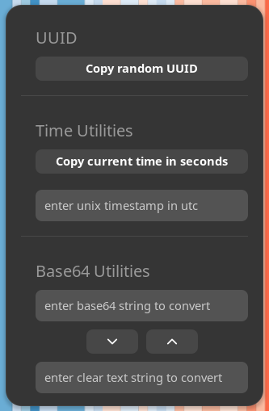

# Dev-Tools

This is my little [Gnome Shell](https://wiki.gnome.org/Projects/GnomeShell) extension. It contains some small helpers that I use on my every day job as a software developer.

These are currently:

- Generating a new random UUID
- Getting the current time in milli seconds

## Contribution

You can clone the extension from github and send me pull requests.

### How to run it locally

First you have to install the dependencies with `npm ci`. Then you are able to build, install and run the extension simply by `npm run dev`.

For more information see [https://gjs.guide/extensions/topics/extension.html](https://gjs.guide/extensions/topics/extension.html).
